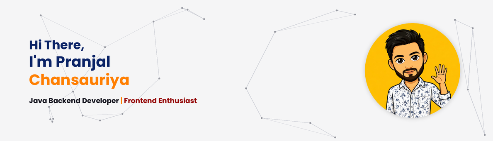

 

  
  
  
  

---

### 🚀 About Me

- 🎓 B.Tech Computer Science Engineering undergraduate at **LNCT, Bhopal** (Expected 2027) — CGPA 8.0
- 💻 Strong foundation in **Java, DSA, OOP, DBMS, Operating Systems & Computer Networks**
- 🌐 Passionate about **Frontend Development**, building responsive, animated web experiences
- 🏆 Internal Round Qualifier at **Smart India Hackathon (SIH) 2025**
- 📚 Always leveling up with certifications in cybersecurity, CRM automation, and platform engineering
- 📍 Based in Bhopal, Madhya Pradesh, India

---

### 🛠 Tech Stack

**Languages**

**Tools**

**Core Concepts:** Data Structures & Algorithms · OOP · Operating Systems · DBMS · Software Engineering

---

### 🎓 Education

| Degree | Institute | Duration | Score |
|---|---|---|---|
| B.Tech – Computer Science Engineering | Lakshmi Narain College of Technology, Bhopal | 2024 – Expected 2027 | CGPA 8.0 |
| Diploma – Computer Science Engineering | Rajiv Gandhi Proudyogiki Vishwavidyalaya (RGPV) | 2021 – 2024 | CGPA 7.46 |
| Class X (CBSE) | Vardhaman Public School, Itarsi | — | 88.4% |

---

### 📌 Featured Work

**🩺 Cura AI — Smart India Hackathon 2025**
AI-driven public health chatbot for disease awareness and early health guidance, built as part of Team Sympto-Sense. Contributed as a Frontend Development team member. Qualified in the internal round.

**🛒 E-Commerce Backend — Java · Spring Boot · MySQL · REST APIs**
Backend system for product, user, cart, and order management. Implemented MVC architecture, Spring Data JPA, request validation, and global exception handling.

**🌐 Portfolio Website — HTML5 · CSS3 · JavaScript**
Responsive personal portfolio built with Flexbox, CSS Grid, and media queries, featuring smooth scrolling and interactive animations. Deployed on Vercel.
🔗 [View Live](https://portfolio-website-red-five-64.vercel.app)

---

### 📜 Certifications

- 🔐 **Cyber Security** — IIT Jodhpur (TISC): threats, vulnerabilities, network security, cryptography, incident response
- ⚙️ **Salesforce Agentforce Specialist**: CRM automation & AI-driven customer service workflows
- 🛠 **ServiceNow Virtual Internship**: platform fundamentals, workflow automation, Flow Designer, Automated Test Framework (ATF), Report Generation, CSA concepts

---

### 📈 GitHub Stats

  
  

  

---

### 📬 Let's Connect

I'm actively looking for opportunities in **Frontend & Java Backend Development**.
Feel free to reach out — always happy to talk code, projects, or hackathons!

⭐ Thanks for stopping by my profile ⭐

